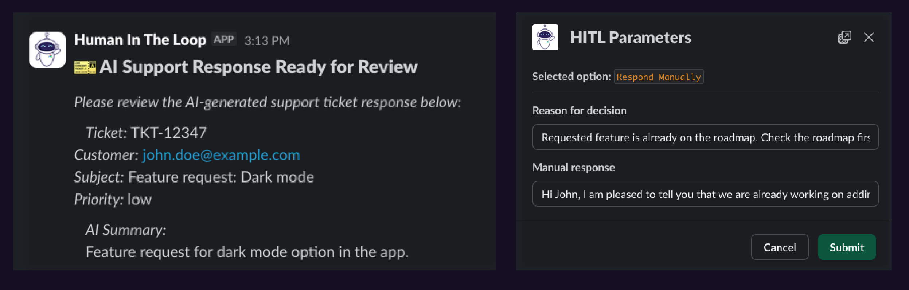

# Airflow Human-in-the–Loop (HITL) + Slack plugin to create a decision tracing context graph

This repo contains an [Airflow plugin](plugins/hitl_slack_plugin.py) and [AWS Lambda function](lambda/) that allows you to create a Human-in-the–Loop (HITL) workflow where your Airflow Dag posts a message to Slack, pauses and waits for a human to respond to the message before continuing. The response and reasoning of the human is stored in Airflow and can be accessed via the Airflow API to make it available as context to an AI agent. You can learn more about the full use case and the decision tracing context graph in this blog post.



## How to use this repo

### Prerequisites

- An Astro Deployment running Airflow 3.1+. A [free trial](https://www.astronomer.io/lp/signup/?utm_source=github&utm_medium=content&utm_campaign=260204-blog-decision-tracing-context-graph) is available.
- A Slack workspace and permissions to create a Slack app and send messages to a channel. 
- Access to AWS with permissions to create an AWS Lambda function, S3 bucket and IAM roles and policies.
- Optional: If you want to run the full use case, you need an OpenAI API key, the [Syntax example Dag](dags/syntax_dag.py) does not require an OpenAI API key.

## Setup instructions

Note that while setting up, you'll occassionally need to go back and forth between the components to retrieve and add the necessary credentials.

### Setting up the Astro Deployment

1. Create a new Astro Deployment or use an existing one.
2. Retrieve your Astro Deployment API URL and API token from the Astro Deployment page, see [the Astronomer docs for more information](https://www.astronomer.io/docs/astro/airflow-api).
3. Deploy this project to your Astro Deployment using `astro deploy`. This will add both the example Dags, as well as the HITL Slack plugin.
3. Add the following [environment variables](https://www.astronomer.io/docs/astro/environment-variables) to the Astro Deployment as soon as you have retrieved them when setting up the AWS Lambda function.
- `HITL_LAMBDA_URL`: The URL of the AWS Lambda function that will be used to send HITL messages to the Slack channel.
- `HITL_WEBHOOK_SECRET`: A shared secret for authenticating requests from the AWS Lambda function.
- `OPEN_AI_API_KEY`: (optional) The API key for the OpenAI API if you want to run the [AI Support Ticket System](dags/ai_support_ticket_system.py) Dag.

### Setting up the Slack app

#### 1. Create the App

1. Go to [https://api.slack.com/apps](https://api.slack.com/apps)
2. Click **"Create New App"**
3. Choose **"From scratch"**
4. Name it (e.g., "Airflow HITL") and select your workspace

#### 2. Get the Signing Secret

1. On the app page, go to **"Basic Information"**
2. Scroll to **"App Credentials"**
3. Copy the **"Signing Secret"** → add this to your Lambda [`.env`](lambda/.env_example) as `SLACK_SIGNING_SECRET`

#### 3. Set Up Bot Permissions

1. Go to **"OAuth & Permissions"** in the sidebar
2. Scroll to **"Scopes"** → **"Bot Token Scopes"**
3. Add these scopes:
   - `chat:write` (send messages)
   - `chat:write.public` (send to channels without joining)

#### 4. Install to Workspace

1. Go back to **"OAuth & Permissions"**
2. Click **"Install to Workspace"**
3. Authorize the app
4. Copy the **"Bot User OAuth Token"** (starts with `xoxb-`) → add this to your Lambda [`.env`](lambda/.env_example) as `SLACK_BOT_TOKEN`

#### 5. Enable Interactivity

1. Go to **"Interactivity & Shortcuts"** in the sidebar
2. Toggle **"Interactivity"** ON
3. For **"Request URL"**, enter your Lambda URL as soon as you have retrieved it when setting up the AWS Lambda function.
   ```
   https://<your-lambda-id>.execute-api.<region>.amazonaws.com/Prod/from-slack
   ```
4. Click **"Save Changes"**

### Setting up the AWS Lambda function

1. Install the AWS SAM CLI `sam`, see [the AWS docs for installation instructions](https://docs.aws.amazon.com/serverless-application-model/latest/developerguide/install-sam-cli.html).

2. Copy `/lambda/.env_example` to `/lambda/.env` and fill in your values. 

- `ASTRO_API_URL`: The Astro deployment API URL, see [the Astronomer docs for more information](https://www.astronomer.io/docs/astro/airflow-api).
- `ASTRO_API_TOKEN`: The Astro deployment API token, see [the Astronomer docs for more information](https://www.astronomer.io/docs/astro/airflow-api).
- `WEBHOOK_SECRET`: A shared secret for authenticating requests from Airflow, you can generate one with: `openssl rand -hex 32`.
- `SLACK_SIGNING_SECRET`: The Slack app signing secret, you can get it from the Slack app's Basic Information page.
- `SLACK_BOT_TOKEN`: The Slack bot OAuth token, you can get it from the Slack app's OAuth & Permissions page after installing.
- `SLACK_CHANNEL`: The Slack channel ID to send HITL messages to, you can get it by right-clicking a channel in Slack -> View channel details -> copy Channel ID.
- `S3_BUCKET`: The S3 bucket to use for the lambda function, you can create a new S3 bucket or use an existing one.
- `AWS_REGION`: The AWS region to deploy the lambda function to, you can use the default region `us-east-1`.

3. Build the lambda function. If you have Docker installed, you can use the `sam build --use-container` command. Otherwise, you can use the `sam build` command.

4. Deploy the lambda function to AWS:

```bash 
source .env && ./lambda/deploy.sh
```

5. Get the lambda function URL to add it to the Astro Deployment as `HITL_LAMBDA_URL`.
```
sam list stack-outputs --stack-name hitl-slack-webhook --region <your-aws-region>
```

## Test the setup

1. Run the [Syntax example Dag](dags/syntax_dag.py) to test the setup. As soon as the `syntax_example_hitl_task` is running, a message will be sent to the Slack channel you configured.
2. Click the button in the Slack message to open the modal and test the HITL workflow.
3. Check the logs of the `print_response` task to see the response.
4. The [gathering_decision_trace](dags/gathering_decision_trace.py) Dag can be used to query the HITL information from the latest run of a Dag and write it to a markdown file in the include/decision_traces directory, which is accessible to the AI agent in the [AI Support Ticket System](dags/ai_support_ticket_system.py) Dag.

## Learn more

- [Orchestrate LLMs and Agents with Apache Airflow® ebook](https://www.astronomer.io/ebooks/orchestrate-llms-and-agents-with-airflow?utm_source=github&utm_medium=content&utm_campaign=260204-blog-decision-tracing-context-graph)